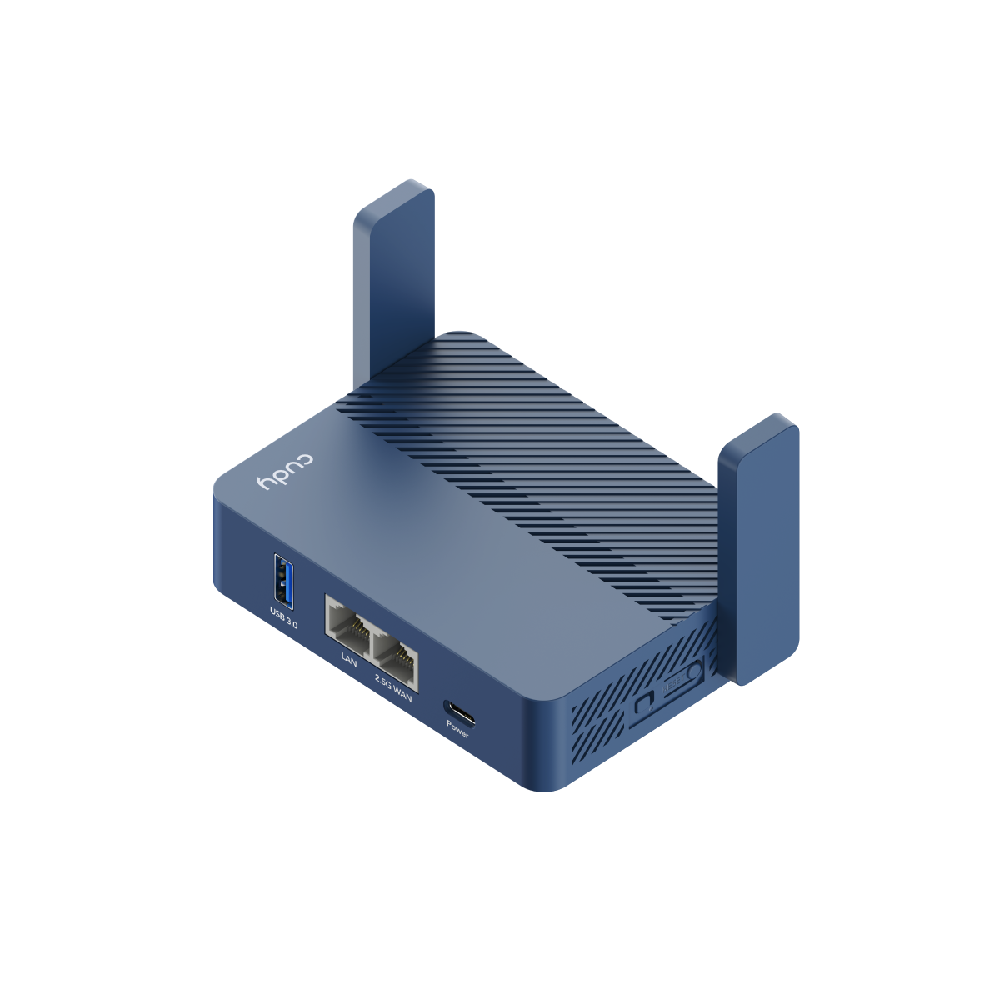
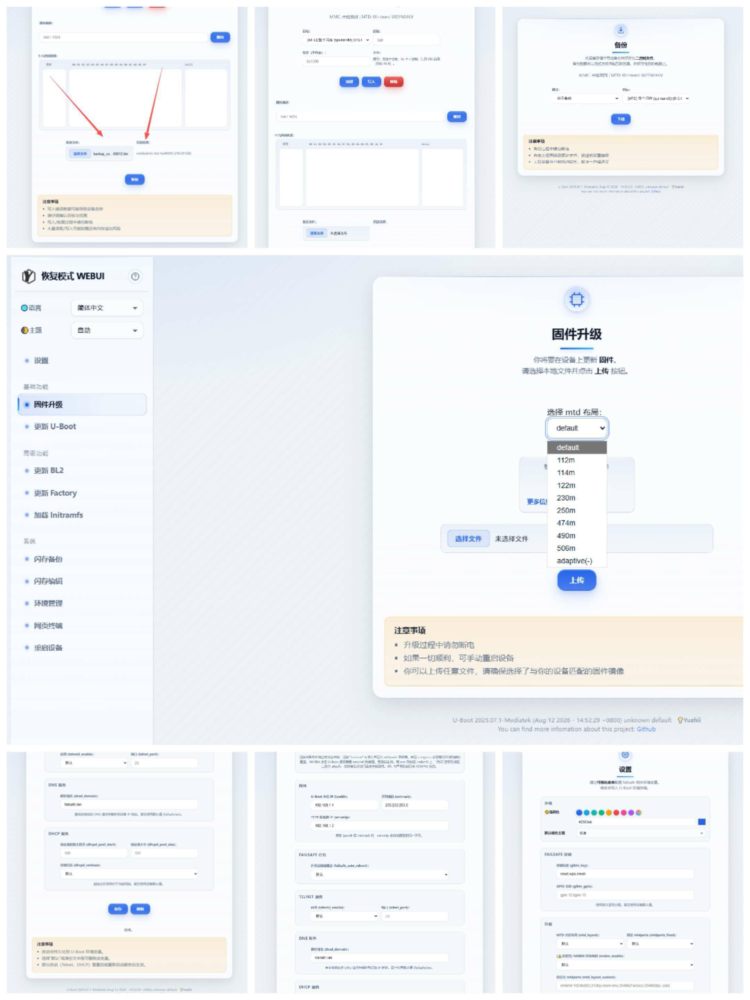

<div align=center>

</div>

## immortalwrt 源码

由gpzy1988修改与[weekdaycare](https://github.com/weekdaycare/immortalwrt-mt7981-cudy-tr3000)的代码，只增加了512MB的固件
---

## ubootmod 固件

本仓库默认编译的 ubootmod 固件为 112M 分区，若你想编译 122M 分区固件，请将 `diy-part2.sh` 中取消以下注释：

```sh
# set ubi to 122M
# sed -i 's/reg = <0x5c0000 0x7000000>;/reg = <0x5c0000 0x7a40000>;/' target/linux/mediatek/dts/mt7981b-cudy-tr3000-v1-ubootmod.dts
```

---

## USB 供电控制

若你想关闭 USB 供电执行命令

```bash
echo 0 > /sys/class/gpio/modem_power/value
```

恢复供电执行命令

```bash
echo 1 > /sys/class/gpio/modem_power/value
```

---

## 第三方软件包

- [OpenClash](https://github.com/vernesong/OpenClash)
- [Bandix](https://github.com/timsaya/luci-app-bandix)
- [luci-theme-aurora](https://github.com/eamonxg/luci-theme-aurora)
- [luci-app-aurora-config](https://github.com/eamonxg/luci-app-aurora-config)
- luci-app-ttyd
- luci-app-upnp
- kmod-usb-net-cdc-ether
- kmod-usb-net-rndis
- kmod-mtd-rw

---

## SSH 连接 Action

可以通过 ssh 连接到 Action 工作流来配置 `menuconfig` 。示例：
```bash
ssh XXXXXXXXXX@XXXXXX.XXX.io
##然后按 Q ，继续输入指令
cd openwrt
make menuconfig
cd ..
touch continue
```
完成定制

---

## 编译注意事项

GitHub Actions 存储有限，大型软件包（如 sing-box 或 alist）建议使用预编译方式，而不是源码编译，即在编译过程中加入已经编译好现成软件包。否则你应该会碰到超长编译时间 + 超出 Action 储存。示例：

```sh
# 创建存储二进制文件的目录
BIN_DIR="$GITHUB_WORKSPACE/openwrt/files/usr/bin"
mkdir -p "$BIN_DIR"

# -------- 下载并解压 xray-core ARM64 -------
echo "Downloading xray-core..."
curl -L -o xray.zip https://github.com/XTLS/Xray-core/releases/download/v25.10.15/Xray-linux-arm64-v8a.zip
unzip -o xray.zip -d "$BIN_DIR"
chmod +x "$BIN_DIR/xray"
rm xray.zip

# -------- 下载并解压 sing-box ARM64 -------
echo "Downloading sing-box..."
curl -L -o sing-box.tar.gz https://github.com/SagerNet/sing-box/releases/download/v1.12.12/sing-box-1.12.12-linux-arm64.tar.gz
TMP_DIR=$(mktemp -d)
tar -xzf sing-box.tar.gz -C "$TMP_DIR"
mv "$TMP_DIR"/sing-box-1.12.12-linux-arm64/sing-box "$BIN_DIR"/sing-box
chmod +x "$BIN_DIR/sing-box"
rm -rf "$TMP_DIR"
rm sing-box.tar.gz
```

---

## 上传 uboot 固件文件

```bash
## 分别执行以下命令上传 U-Boot 分区文件（请根据你的文件名替换命令中的文件名）：
scp mt7981_cudy_tr3000-v1-bl2_XXXX.bin root@192.168.6.1:/tmp
scp mt7981_cudy_tr3000-v1-fip-fixed-parts-multi-layout_XXXX.bin root@192.168.6.1:/tmp

## SSH登录路由器
ssh root@192.168.6.1

## 执行命令解锁 MTD 分区，否则无法写入分区（提示Could not open mtd device）
insmod mtd-rw i_want_a_brick=1

## 执行写入命令刷入 BL2 和 FIP：
mtd write /tmp/mt7981_cudy_tr3000-v1-bl2_XXXX.bin BL2
mtd write /tmp/mt7981_cudy_tr3000-v1-fip-fixed-parts-multi-layout_XXXX.bin FIP

## 校验分区是否成功写入，如无意外会提示 success
mtd verify /tmp/mt7981_cudy_tr3000-v1-bl2_XXXX.bin BL2
mtd verify /tmp/mt7981_cudy_tr3000-v1-fip-fixed-parts-multi-layout_XXXX.bin FIP
```


## UBOOT 多合一分区
---
## DHCP uboot
# 面向MT798X的带DHCPD的ATF与U-Boot
这是由gpzy1988基于Yuzhii修改的U-Boot修改而来的MT798x专用版本，Yuzhii修改的DHCPD支持和美观的网页UI的基础上增加了512MB大容量flash的支持，目前提供2025/SP1/SP2三个版本的编译支持。
支持GitHub Actions自动编译，GitHub Actions自动编译由gpzy1988修改成了可定义参数的模式，可自定义生成uboot。

&zwnj;**警告：刷入自定义引导加载程序可能导致设备变砖。请谨慎操作，一切后果自行承担。**&zwnj;
---

<div align=center>

</div>

---
## 关于 bl-mt798x
U-Boot 2025新增了诸多功能：
- 系统信息展示
- 工厂（RF）升级
- 备份下载
- 闪存编辑器
- Web终端
- 环境变量管理器
- 主题管理器
- 多语言支持
- 设备重启
- UBI卷管理
---
你可以按需自定义配置需要的功能：
- [x] MTK_DHCPD
  - [x] MTK_DHCPD_USE_CONFIG_IP
  - MTK_DHCPD_POOL_START_HOST 默认值为100
  - MTK_DHCPD_POOL_SIZE 默认值为101
- [ ] MTK_TELNETD
- 故障保护网页UI样式：
  - [x] WEBUI_FAILSAFE_UI_BOOTSTRAP
    - [x] WEBUI_FAILSAFE_I18N
  - [ ] WEBUI_FAILSAFE_UI_GL
  - [ ] WEBUI_FAILSAFE_UI_MTK
- [x] WEBUI_FAILSAFE_ADVANCED - 启用高级功能
  - [ ] WEBUI_FAILSAFE_SIMG - 启用单镜像升级
  - [x] WEBUI_FAILSAFE_FACTORY - 启用工厂（RF）升级
  - [x] WEBUI_FAILSAFE_BACKUP - 启用备份下载
  - [x] WEBUI_FAILSAFE_ENV - 启用环境变量管理器
  - [x] WEBUI_FAILSAFE_CONSOLE - 启用Web终端
  - [x] WEBUI_FAILSAFE_FLASH - 启用闪存编辑器
  - [x] WEBUI_FAILSAFE_UBI - 启用UBI卷管理
---
## 环境准备
```
sudo apt install gcc-aarch64-linux-gnu build-essential flex bison libssl-dev device-tree-compiler qemu-user-static nodejs npm
```

> 如果你需要为armv7l架构设备编译，还需要额外安装 gcc-arm-linux-gnueabi
>
> 故障保护网页UI的资源会在编译时进行压缩处理。如果你手动编译U-Boot，请在 uboot-mtk-20250711/failsafe/embedded 目录下执行一次 npm install，安装本地压缩工具依赖。该操作会被 build.sh 脚本自动完成。
---
## 编译流程
首次配置请执行：
```
make menuconfig
```

确认配置后基于当前的 .config 选择项编译：
```
make
```
在 make menuconfig 中，你可以通过以下选项控制 make 是否执行FIP构建（build.sh）、ATF编译（compile_atf.sh）和GPT生成（generate_gpt.sh）：
- BUILD_FIP
- BUILD_ATF
- BUILD_GPT

编译所选版本的所有机型固件：
```
make all
```

查看编译帮助：
```
make help
```

单机型编译示例：
```
# mt7981平台，eMMC设备
make BOARD=sn_r1
# mt7981平台，SPI-NAND设备，非MBM设备，支持多布局
make BOARD=zbt_z8103ax-c VARIANT=NONMBM
# mt7986平台，SPI-NAND设备，支持多布局，启用单镜像升级支持
make BOARD=ruijie_rg-x60-new VERSION=SP1 SIMG=1
```

列出指定版本下支持的所有设备型号：
```
make boards VERSION=2025
```
- Version 参数（默认值：2025。可选，用于指定不同版本的ATF和U-Boot）

| 版本号 | ATF版本 | UBOOT版本 |
| --- | --- | --- |
| 2025 | 20250711 | 20250711 |
| SP1 | 20241017-bacca82a8 | 20250711 |
| SP2 | 20260123 | 20250711 |

> SP1：部分仍使用内核5.4固件的设备，在2025版本下可能会出现硬件随机数生成器异常等问题，遇到这类问题时可以尝试切换到SP1版本。
>
> SP2：针对新平台（如MT7987）或最新内核做了适配优化，提升兼容性。

- VARIANT 参数（默认值：default。可选，用于指定不同的固件变体）

> 通常情况下，VARIANT 是为MTD设备准备的。

| 变体名称 | 说明 | 适配固件类型 |
| --- | --- | --- |
| default | 推荐用于保留原厂/自定义分区布局的设备，启用MTK-NMBM，适合绝大多数普通用户 | 原厂/自定义分区布局固件 |
| nonmbm | 推荐用于保留原厂/自定义分区布局的设备，禁用MTK-NMBM | 未启用MTK-NMBM的原厂/自定义分区布局固件 |
| ubootmod | 针对OpenWrt/ImmortalWrt固件做了适配优化，提升兼容性 | ubootmod布局固件 |
| ubi | 专门为UBI布局设计（例如：spi-nand0:1024k(bl2),-(ubi)） | UBI布局固件 |
| openwrt | 来自OpenWrt官方仓库的版本，目前不包含故障保护网页UI | OpenWrt官方固件 |


其他可用选项：
| 选项名 | 类型 | 是否必填 | 默认值 | 说明 |
| --- | --- | --- | --- | --- |
| SOC | 字符串 | 否 | 无 | 自动检测，你可以手动设置SOC=mt7981、SOC=mt7986或其他mt798x系列平台 |
| MULTI_LAYOUT | 布尔值 | 否 | 1 | 你可以设置MULTI_LAYOUT=0来禁用多布局支持（仅适用于NAND设备） |
| FIXED_MTDPARTS | 布尔值 | 否 | 1 | 你可以设置FIXED_MTDPARTS=0让MTD分区可编辑，但如果你不了解相关原理可能引发异常，因此默认设为1使用固定MTD分区布局（仅适用于NAND设备）。 |
| FSTHEME | 字符串 | 否 | bootstrap | 你可以设置FSTHEME=bootstrap/gl/mtk来更换故障保护网页UI的主题，支持bootstrap、gl、mtk三种样式。 |
| SIMG | 布尔值 | 否 | 无 | SIMG=1 表示在故障保护网页UI中启用单镜像升级支持，如果你不了解相关原理可能引发异常，因此默认设为0禁用该功能。 |
| UBIMNG | 布尔值 | 否 | 0 | UBIMNG=1 在故障保护网页UI中启用UBI卷管理功能。需要设备为支持UBI的MTD设备。 |
| TELNETD | 布尔值 | 否 | 0 | TELNETD=1 在故障保护模式下启用符合RFC 854标准的Telnet服务器，可通过TCP 23端口访问U-Boot命令行界面。 |
| CLEAN | 布尔值 | 否 | 无 | 传入 --clean 参数可以在编译前清理构建环境。 |

> &zwnj;**注意：MULTI_LAYOUT=1 和 FIXED_MTDPARTS=0 不能同时启用**&zwnj;

编译生成的文件会存放在 output 目录下。

关于直接使用 *.sh 脚本的详细说明，请参考 doc/tools.md。

---
## 使用GitHub Actions自动构建
你需要先将该仓库Fork到自己的GitHub账号下，之后就可以通过Actions流水线自动编译固件，生成的文件会保存在artifacts页面或者releases页面。
- [x] 构建FIP固件
  - [x] 支持单机型/全机型/全MT798x机型批量构建
  - [x] 支持2025/SP1/SP2/全版本选择
  - [ ] VARIANT变体参数支持
  - [ ] 额外自定义参数支持
  > VERSION:all 仅在单机型构建时可用
- [x] 构建GPT镜像
  - [x] 支持官方分区布局
  - [ ] 支持自定义分区布局
- [x] 构建BL2预loader
  - [x] 支持RAMBOOT启动
  - [ ] 超频配置文件支持

> 如果你想编译旧版本（<2025），可以切换到"old-version"分支
> 当前分支仅保留2025/SP1/SP2三个版本的支持。

---
## 使用Python2.7生成GPT镜像
> 先安装依赖
```
sudo apt-get install python2 python2-dev
```
> 执行生成命令
```
make gpt
```
生成的文件会存放在 output_gpt 目录下。
> 你需要将设备的分区信息JSON文件放到仓库的 mt798x_gpt 目录中，参考示例路径为 atf-dir/tools/dev/gpt_editor/example/gpt.json。

当启用 SDMMC=1 参数（例如执行 make gpt SDMMC=1）时，生成的GPT镜像将支持MTK SDMMC功能。

---
### 查看GPT分区信息
在仓库根目录下新建名为 mt798x_gpt_bin 的文件夹，将你手头的GPT二进制文件放入其中。

然后执行命令：
```
make gpt SHOW=1
```
脚本会解析显示 mt798x_gpt_bin 目录下所有GPT文件的分区信息，并将结果输出到 output_gpt 目录下的 gpt_info.txt 文件中。

---
### 绘制GPT布局图
先安装Pillow库依赖：
```
pip3 install Pillow
```
然后执行命令：
```
make gpt DRAW=1
```
---
## 编译ATF固件
```
make atf
```
编译完成后会在 output 目录下生成BL2预loader，默认生成支持RAMBOOT启动的BL2版本。

---
### 超频配置文件说明
调整ARMPLL频率是&zwnj;**非常危险的操作**&zwnj;。
如果不了解相关原理可能引发各类异常，甚至直接导致设备变砖！
因此默认使用官方标准频率以保证安全，你可以手动开启超频配置文件调整ARMPLL频率，但操作时务必要万分小心。

- 对于MT7981平台，目前支持超频到1.4GHz~1.8GHz，相关超频配置文件存放在 mt798x_atf/mt7981 目录下。
示例：编译1.6GHz超频版BL2需要在配置中打开：
```
MT7981_ARMPLL_FREQ_1600=y
```

- 对于MT7986平台，目前支持超频到2.5GHz，也可以降频到1.6GHz，相关超频配置文件存放在 mt798x_atf/mt7986 目录下。
示例：编译2.3GHz超频版BL2需要在配置中打开：
```
MT7986_ARMPLL_FREQ_2300=y
```

> MT798x平台每次频率调整建议步进为100MHz，MT762x平台每次调整步进建议为50MHz。推荐逐步调整频率，例如从1.6GHz先调到1.7GHz，确认稳定后再调到1.8GHz。

不同平台支持的ARMPLL频率调整范围：
| 版本 | mt7622 | mt7629 | mt7981 | mt7986 | mt7987 | mt7988 |
| --- | --- | --- | --- | --- | --- | --- |
| TF-A 2024 | 不支持 | 不支持 | 1.3GHz~1.8GHz | 1.6GHz~2.5GHz | 无相关适配 | 不支持 |
| TF-A 2025 | 1.35GHz~1.7GHz | 1.2GHz~1.5GHz | 1.3GHz~1.8GHz | 1.6GHz~2.5GHz | 不支持 | 不支持 |
| TF-A 2026 | 不支持 | 不支持 | 不支持 | 不支持 | 不支持 | 不支持 |

### 其他ATF编译选项
这些选项仅对 normal 目录下的构建生效。

| 选项名 | 类型 | 是否必填 | 默认值 | 说明 |
| --- | --- | --- | --- | --- |
| VARIANT | 字符串 | 否 | 无 | 你可以设置VARIANT=NONMBM/UBOOTMOD来构建不同变体的BL2，NONMBM表示构建禁用MTK-NMBM的BL2，UBOOTMOD表示构建经过适配优化、提升OpenWrt/ImmortalWrt固件兼容性的BL2，如果你不了解相关原理可能引发异常，因此默认不设置参数使用标准BL2变体。 |
| OC7981 | 整数 | 否 | 无 | 你可以设置OC7981=13-18来构建MT7981平台不同频率的超频BL2，最终频率值为 OC7981*100MHz，例如OC7981=16表示1.6GHz，如果你不了解相关原理可能引发异常，因此默认不设置参数使用标准频率。 |
| OC7986 | 整数 | 否 | 无 | 你可以设置OC7986=16-25来构建MT7986平台不同频率的超频BL2，最终频率值为 OC7986*100MHz，例如OC7986=23表示2.3GHz，如果你不了解相关原理可能引发异常，因此默认不设置参数使用标准频率。 |

---

## FIT镜像支持
&zwnj;**你必须自行完成相关功能测试，操作有设备变砖的风险！**&zwnj;

提供两种构建方式：
- 本地编译
```
make BOARD=你的设备型号 VERSION=2025 VARIANT=ubootmod
```

---
- 通过GitHub Actions自动构建

刷入教程：
1. 进入故障保护网页UI，&zwnj;**备份你的所有闪存内容和全部分区**&zwnj;，这一步非常重要！
2. 在网页UI中更新BL2预loader，刷入OpenWrt/ImmortalWrt ubootmod固件配套的预loader。
3. 在网页UI中更新U-Boot，刷入FIT版本的FIP固件。
4. 使用网页UI中的闪存编辑器擦除UBI分区（也可以通过命令行执行：mtd erase ubi），NAND设备需要执行这一步。
5. 尝试在固件升级页面刷入OpenWrt/ImmortalWrt ubootmod固件，如果升级失败则继续执行下一步。
6. 通过故障保护网页UI的Initramfs功能引导启动OpenWrt/ImmortalWrt ubootmod的Initramfs镜像。
7. 如果设备成功进入OpenWrt/ImmortalWrt系统，就可以再次尝试在固件升级页面刷入完整的OpenWrt/ImmortalWrt ubootmod固件。

---

## 最佳实践指南
1. 通过TTL串口工具连接设备，并使用 [MTK UARTBOOT](https://github.com/981213/mtk_uartboot/releases)/[MTK-LAUNCHPAD](https://github.com/Yuzhii0718/mtk-launchpad) 执行RAMBOOT启动。
2. 在网页UI中（默认快速访问地址为 `http://failsafe.lan`)，完整备份所有闪存内容和全部分区，这一步是保障设备安全的核心操作！
3. 在网页UI中更新U-Boot并升级固件。
4. 如果操作过程中出现异常，可以通过之前的备份文件恢复设备。

---
### 修改故障保护网页UI的启动按键
默认配置为 glbtn_key=reset,wps,mesh，表示glbtn命令会按照标签顺序依次搜索名为"reset"、"wps"和"mesh"的GPIO引脚，使用第一个找到的引脚作为故障保护网页UI的触发按键。
目前支持以下自定义配置方式：
- glbtn_gpio=<gpio引脚号>
  → 直接指定读取对应的GPIO引脚。
- glbtn_key=<标签名>
  → 仍然通过标签名称搜索对应引脚。

配置示例：
- 直接指定GPIO引脚：
  setenv glbtn_gpio 0
- 添加 gpio: 前缀的写法：
  setenv glbtn_gpio gpio:0
  > 0、gpio 0、pio 0、gpio:0、pio0 这几种写法效果完全相同。
- 反转引脚触发信号：
  setenv glbtn_gpio !0
  > !gpio 0、!pio 0、!gpio:0、!pio0 这几种写法效果完全相同。
- 通过标签名扫描GPIO引脚：
  setenv glbtn_key wps
  > 支持指定wps、reset、mesh等自定义标签。

> 修改完成后需要执行saveenv保存环境变量，然后重启设备才能让配置生效。

---
### 手动修改MTD分区布局
仅适用于支持多布局的设备。
将mtdparts环境变量设置为你需要使用的分区布局，重启设备即可生效。
# 最新推荐写法
```
setenv mtd_layout <布局标签名>
```
# 旧版兼容写法
```
setenv mtd_layout_label <布局标签名>
```

> 修改完成后需要执行saveenv保存环境变量，然后重启设备才能让配置生效。

---
### 禁用升级完成后的自动重启
将failsafe_auto_reboot环境变量设置为1/true/yes/on即可开启新版网页UI升级完成后的自动重启功能。

---
### 固件系统中的常用命令
```
fw_setenv env_invalid 1 # 下次启动时将U-Boot环境变量重置为默认值
fw_setenv failsafe 1 # 下次启动时自动进入故障保护模式
```

> 在编译固件前，你需要先安装uboot-envtools软件包，并正确配置package/boot/uboot-envtools/files/mediatek_filogic文件适配你的设备，否则环境变量修改操作不会生效。

---
### Telnet功能支持
你可以通过Telnet协议连接设备，默认端口为23，也可以通过设置telnet_port环境变量自定义连接端口。
TelnetD默认是启用状态，你可以将telnetd_enable环境变量设置为0/false/no/off来关闭Telnet服务。

---
### 统一环境变量控制NMBM开关（仅适用于MTD设备）
你可以将nmbm_enable环境变量设置为0/false/no/off来关闭MTK-NMBM功能。
> 该功能仅适用于编译阶段已经开启MTK-NMBM相关配置的MTD设备。

关于NMBM开关控制的更多详细说明，请参考 统一环境变量控制NMBM开关 文档。

---

## 尾注说明
1*: 如果你的设备是MMC存储类型，完整备份全闪存内容是不现实的，可以根据固件大小选择性备份，通常固件大小仅为200MB~300MB。
2*: 如果你的设备是MMC存储类型，只需要升级包含生产分区的GPT分区表，就不需要使用ubootmod固件，可以直接使用OpenWrt官方固件。
3*: OpenWrt/ImmortalWrt ubootmod固件是支持FIT镜像的特殊定制固件，在该固件中设备树会从FIT镜像中加载（bootargs参数配置为"root=/dev/fit0 rootwait"），根文件系统从ubi_rootdisk分区加载。推荐使用OpenWrt/ImmortalWrt 24.10及以上的版本。

---

## 旧版本（< U-Boot 2025）
当前分支仅支持 &zwnj;**2025/SP1/SP2**&zwnj; 三个版本。
你可以在"old-version"分支中找到2022/2023/2024等旧版本的代码，但旧版本可能存在已知问题，推荐使用当前分支以获得更完善的使用体验。
相关旧版本使用教程：https://cmi.hanwckf.top/p/mt798x-uboot-usage

---

## MTMIPS相关说明
该部分内容仅用于开发测试，不推荐投入生产环境使用。
```
chmod +x mtmips.sh
SOC=<mt7620|mt7621|mt7628|mt7688> BOARD=<board_name> ./mtmips.sh
```
不推荐直接使用该脚本编译MT7621的U-Boot，因为uboot-mtk-20250711版本的MT7621 U-Boot存在兼容性问题。
如果你需要为MT7621设备编译固件，推荐使用专门优化的 uboot-mt7621-dhcpd 项目，该项目对MT7621设备的适配更稳定完善。

---

## 致谢
- [Yuzhii0718](https://github.com/Yuzhii0718/bl-mt798x-dhcpd)
- [u-boot](https://github.com/u-boot/u-boot)
- [mtk-openwrt](https://github.com/mtk-openwrt)
- [hanwckf](https://github.com/hanwckf/bl-mt798x)
- [Tianling](https://blog.imouto.in/)
- [weekdaycare](https://github.com/weekdaycare/immortalwrt-mt7981-cudy-tr3000)
- [immortalwrt](https://github.com/immortalwrt/immortalwrt)
- [weekdaycare](https://github.com/weekdaycare/bl-mt798x-dhcpd)
- [hanwckf](https://github.com/hanwckf/bl-mt798x)
- [padavanonly](https://github.com/padavanonly/immortalwrt-mt798x-6.6)
- [P3TERX](https://github.com/P3TERX)
- [Microsoft Azure](https://azure.microsoft.com)
- [GitHub Actions](https://github.com/features/actions)
- [OpenWrt](https://github.com/openwrt/openwrt)
- [coolsnowwolf/lede](https://github.com/coolsnowwolf/lede)
- [Mikubill/transfer](https://github.com/Mikubill/transfer)
- [softprops/action-gh-release](https://github.com/softprops/action-gh-release)
- [Mattraks/delete-workflow-runs](https://github.com/Mattraks/delete-workflow-runs)
- [dev-drprasad/delete-older-releases](https://github.com/dev-drprasad/delete-older-releases)
- [peter-evans/repository-dispatch](https://github.com/peter-evans/repository-dispatch)

---


## License

[MIT](https://github.com/P3TERX/Actions-OpenWrt/blob/main/LICENSE) © [**P3TERX**](https://p3terx.com)
